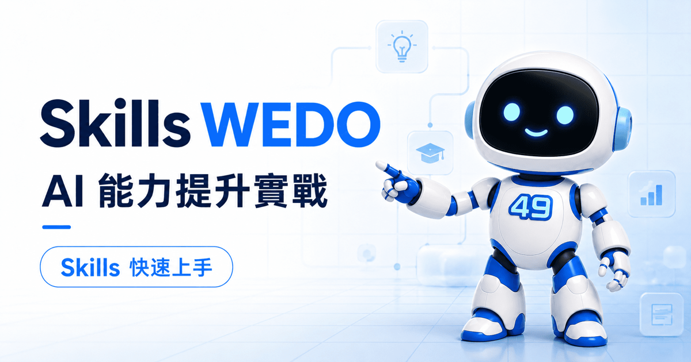

# Skills WEDO

AI 能力提升實戰與 Skills 快速上手 — 繁體中文的 AI Skills 入門平台。



> 線上網站：<https://skills.wedopr.com>
> 推薦 Skills：<https://skills.wedopr.com/#skills-section>

## 這是什麼

很多人第一次聽到 Skills，會以為那只是「一份提示詞」。其實 Skills 是把你的專業流程、參考資料、腳本與檢查標準，整理成 AI 能在需要時自動載入的工作流。

Skills WEDO 的目標，是幫 AI 初學者跨過「知道 Skills 有用」到「真的會挑、會裝、會用」之間那道門檻。首頁用五個步驟帶你走完整條路：

1. 認識 Skills，以及它和 prompt、MCP、`AGENTS.md` / `CLAUDE.md` 專案規則的差異。
2. 到哪裡挑選、尋找初學者友善的推薦 Skills。
3. 如何把 Skills 安裝到 Claude Code、Codex、VS Code Agent 等工具。
4. 安裝後如何明確調用、使用與維護。
5. 如何把重複的工作變成自己的 `SKILL.md`。

## 精選 Skills（可直接取用）

本倉庫的 [`skills/`](skills/) 收錄 **29 個精選、通用、初學者友善的 Skills**，由 WEDO 的私有 SSOT 匯出。完整清單見 [`skills/README.md`](skills/README.md)，涵蓋文件（`pdf`、`docx`、`xlsx`、`pptx`）、內容（`humanizer-zh-tw`、`copywriting`、`seo-content-writer`）、開發（`typescript-expert`、`nextjs-app-router-patterns`）、除錯與測試（`systematic-debugging`、`test-driven-development`）、AI 工程（`mcp-builder`、`rag-engineer`、`langgraph`）與基礎工作流（`skill-creator`、`prompt-engineering`、`plan-writing`）等。

安裝一個 Skill，就是把資料夾複製到你的工具目錄：

```bash
# Claude Code
cp -R skills/skill-creator ~/.claude/skills/
# Codex
cp -R skills/skill-creator ~/.codex/skills/
```

裝好後在對話直接用自然語言觸發，例如：「請用 `pdf` 幫我整理這份 PDF 的重點」「請用 `systematic-debugging` 追這個測試失敗的根因」。不需要斜線指令，講到名字或用途就會載入。

## 本地預覽

```bash
python3 -m http.server 4190 --bind 127.0.0.1
```

再開啟 <http://127.0.0.1:4190/>。

## 專案數據（每日自動更新）

### 專案參與指標

最後更新：`2026-07-18`（自動更新）

- GitHub Stars（本前台倉庫 `hjuming/skills`）：`1`
- 每月網站到訪（或轉換）量：`待接 Cloudflare 權杖或 Zone ID`
- 每月 issue / PR：`Issue 開啟 0 / 關閉 0；PR 開啟 0 / 關閉 0`
- 每季主要更新次數：`1`

#### 自動更新

- 手動同步：`node scripts/update-public-readme-metrics.mjs`
- 自動同步：GitHub Actions 每日 04:00 UTC 自動執行 .github/workflows/update-public-readme-metrics.yml
- GitHub Stars、issue / PR、季度更新次數會由 API 即時抓取更新；網站流量維持手動更新，或設定 `WEBSITE_MONTHLY_VISITS` 後改為自動化。
- 網站流量可選 `WEBSITE_MONTHLY_VISITS_SOURCE=cloudflare`（Cloudflare Analytics）或 `WEBSITE_MONTHLY_VISITS_SOURCE=ga4`（GA4 Data API），也可用 `WEBSITE_MONTHLY_VISITS` 人工覆寫。

## 專案架構（公開檔案）

本倉庫是 [skills.wedopr.com](https://skills.wedopr.com) 的公開前台，包含靜態網站與精選 Skills：

- 網站：`index.html`、`styles.css`、`app.js`、`skills-data.js`、`sw.js`、`llms.txt`、`robots.txt`、`sitemap.xml`、`_redirects`、`_headers`
- 資產：`assets/*`、`favicon_io/*`
- 精選 Skills：`skills/<name>/`（由私有 SSOT 匯出，請勿手動編輯）

WEDO 內部 workflow Skills、歷史 skill archive、內部設定文件與完整 skills 目錄不在此公開匯出範圍內。

## 維護規則（對外）

- 只納入面向公開訪客的內容；不放入 API key、環境變數、客戶機密流程或私人本機路徑。
- `skills/` 由私有倉庫的匯出流程產生，不在此手改；要調整請回到私有 SSOT。
- 任何新增推薦 Skill，需具備明確用途、可複製範例 prompt，以及可公開查閱的來源。

## 授權與引用

- 精選 Skills 多為社群或官方收錄，各自授權見 `skills/<name>/LICENSE`。
- 引用本站：Skills WEDO.「AI 能力提升實戰與 Skills 快速上手.」WEDO. <https://skills.wedopr.com/>
